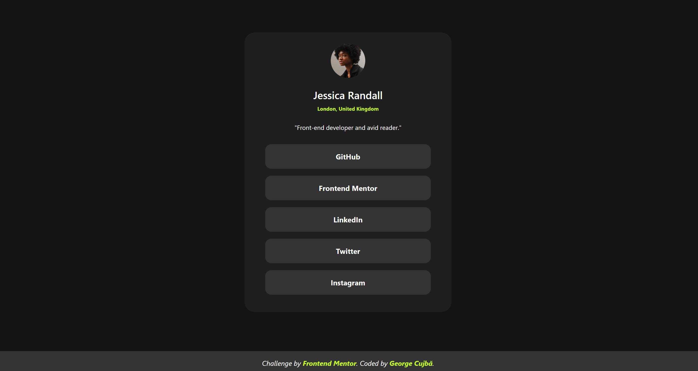

# Frontend Mentor - Social links profile

This is a solution to the [Social links profile challenge on Frontend Mentor](https://www.frontendmentor.io/challenges/social-links-profile-UG32l9m6dQ/hub). Frontend Mentor challenges help you improve your coding skills by building realistic projects.

## Table of contents

- [Overview](#overview)
  - [The challenge](#the-challenge)
  - [Screenshot](#screenshot)
  - [Links](#links)
- [My process](#my-process)
  - [Built with](#built-with)
  - [What I learned](#what-i-learned)
- [Author](#author)

### Screenshot

### Links

- Live Site URL: [Hosted with Github Pages](TBA)

## My process

### Built with

- Semantic HTML5 markup
- Scss
- Flexbox
- Responsive Design
- Media queries

### What I learned

I got to review HTML & Scss syntax.

## Author

- Github - [GeorgeCujbă](https://github.com/GeorgeValentin/)
- Frontend Mentor - [@GeorgeCujbă](https://www.frontendmentor.io/profile/GeorgeValentin)
